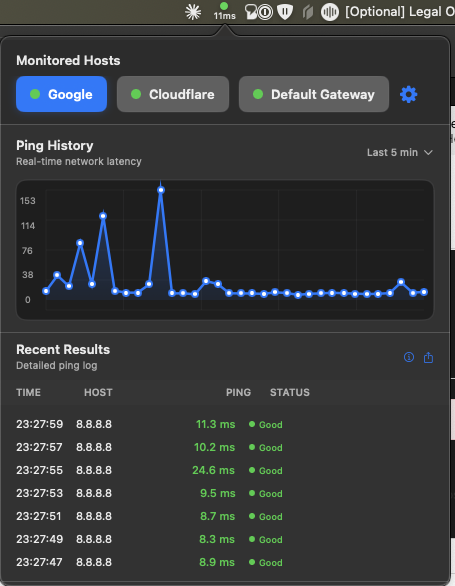
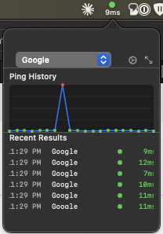
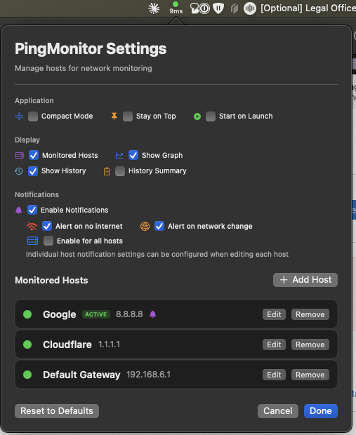

# PingScope

A professional macOS menu bar application for real-time network monitoring with beautiful graphs and detailed ping history.

## Screenshots

### Full Mode



### Compact Mode



### Settings



## Features

### 🎯 Core Functionality
- **Real-time ping monitoring** of multiple hosts simultaneously
- **Beautiful menu bar status** with colored dot and ping time
- **Professional dropdown interface** with tabs, graphs, and history
- **Smart default gateway detection** - automatically finds your router IP

### 📊 Visual Monitoring
- **Interactive host tabs** - Switch between monitored servers
- **Real-time line graphs** with smooth animations and data points
- **Detailed history table** with time, host, ping times, and status
- **Terminal-style ping statistics** panel with min/avg/max/stddev summary
- **Copyable statistics text** for easy sharing/debugging
- **Color-coded status indicators** (Green/Yellow/Red/Gray)

### ⚙️ Settings & Management
- **Complete host management** - Add, edit, and remove custom hosts
- **Professional Settings interface** with real-time status indicators
- **Data export functionality** - CSV, JSON, and Text formats with filtering
- **Enhanced click support** - Ctrl+Click and Cmd+Click for context menu
- **Clean, native macOS design** following Apple's design guidelines

### 🌐 Host Management
- **Flexible host configuration** - Add any IP address or hostname
- **Default hosts included** - Google DNS, Cloudflare, and Default Gateway
- **Full editability** - All hosts can be customized or removed
- **Duplicate prevention** - Smart validation prevents conflicts
- **Ping method selection** - TCP/UDP everywhere, ICMP when runtime supports it

## Installation

1. Download the latest release
2. Move PingScope.app to your Applications folder
3. Launch the app - it will appear in your menu bar
4. Grant network permissions when prompted

## Usage

### Basic Monitoring
- The menu bar shows a colored status dot and current ping time
- **Green**: Good connection (<50ms)
- **Yellow**: Slow connection (50-150ms)
- **Red**: Poor connection (>150ms)
- **Gray**: Connection timeout/error

### Interface Navigation
- **Left-click** the menu bar icon to open the full interface
- **Right-click/Ctrl+Click/Cmd+Click** for quick host switching and settings
- **Click host tabs** to switch between monitored servers
- **Use the gear menu** for settings and export options

### Settings & Export
- **Settings Interface**: Add, edit, and remove hosts with real-time status
- **Export Data**: Generate reports in CSV, JSON, or Text formats
- **Time Range Filtering**: Export last hour, 24 hours, week, or all data
- **Host-specific Export**: Export data for all hosts or specific ones

## Technical Details

### Requirements
- macOS 13.0 or later
- Network permissions for ping operations

### Architecture
- **SwiftUI** for modern, native interface
- **Real-time ping monitoring** using system ping command
- **Multi-host concurrent monitoring** with separate timers
- **Data persistence** with automatic history management
- **Native menu bar integration** with proper click handling

### Performance
- **Lightweight**: Minimal CPU and memory usage
- **Efficient**: Smart ping scheduling and data management
- **Responsive**: Non-blocking UI with background ping operations

## Development

### Building from Source
```bash
git clone https://github.com/keithah/pingscope.git
cd pingscope
swiftc PingScope.swift -o PingScope
./PingScope
```

### Project Structure
```
PingScope/
├── Sources/                   # App source code
├── .github/workflows/          # GitHub Actions CI/CD
├── README.md                   # Documentation
├── LICENSE                     # MIT License
└── images/                     # Screenshots
```

## Issues & Roadmap

Have ideas for new features or found a bug? Check out our [GitHub Issues](https://github.com/keithah/pingscope/issues) to:
- Report bugs and issues
- Request new features
- View planned enhancements
- Contribute to development

## Contributing

1. Fork the repository
2. Create a feature branch (`git checkout -b feature/amazing-feature`)
3. Commit your changes (`git commit -m 'Add amazing feature'`)
4. Push to the branch (`git push origin feature/amazing-feature`)
5. Open a Pull Request

## License

This project is licensed under the MIT License - see the [LICENSE](LICENSE) file for details.

## Acknowledgments

- Built with SwiftUI and AppKit
- Inspired by professional network monitoring tools
- Designed for macOS menu bar integration

---

**PingScope** - Professional network monitoring for macOS
