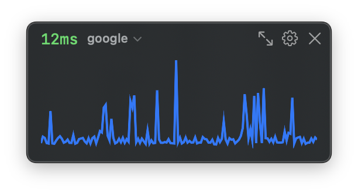
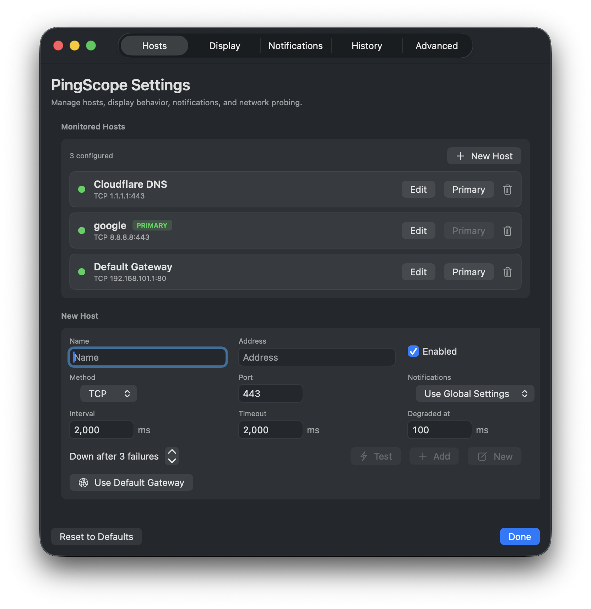
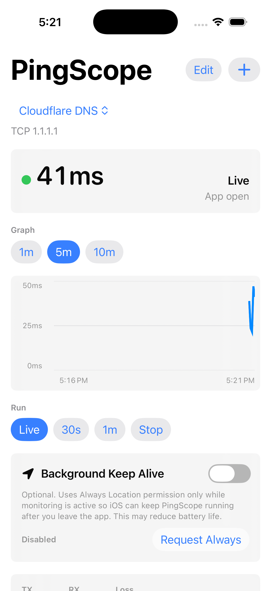

# PingScope

PingScope is a native macOS menu bar latency monitor for people who want a quiet, always-available signal about their network. It shows an iStat-style menu bar readout, a focused live graph popover, and an optional floating overlay.

PingScope is primarily a Mac app, with an iOS companion app in progress:

- **Developer ID builds** support TCP, UDP, and ICMP probes where macOS permits them, plus Sparkle updates from a GitHub Pages appcast.
- **App Store builds** stay sandbox-compliant and hide ICMP.
- **iOS builds** monitor continuously while the app is open, offer explicit `30s` and `1m` sessions, publish Live Activity updates during finite background runtime, and keep local recent history. An advanced opt-in Background Keep Alive mode can use Always Location permission while monitoring is active; it is disabled by default.

## Screenshots

| Floating overlay | Hosts settings | iOS companion |
| --- | --- | --- |
|  |  |  |

The compact overlay shows the current latency and a live graph for the selected host; the settings window manages hosts, methods, thresholds, and notification policy; the iOS companion runs continuous or finite sessions with a local history graph.

## Features

- iStat-style menu bar status: colored dot with latency text underneath.
- Live popover with host selector, time range picker, graph, recent samples, packet loss, and min/avg/max stats.
- Floating overlay with resizable full mode, compact graph mode, right-click host selector, settings, popover, and close actions.
- Host management for TCP, UDP, and Developer ID ICMP.
- Default gateway detection.
- Per-host settings for method, port, interval, timeout, degraded threshold, down-after failures, enabled state, and notification policy.
- Notifications for host down, recovery, high latency, internet loss, and selected network status states. Network-change alerts are available but off by default to keep things quiet.
- Durable local history with export to CSV, JSON, or text.
- Widget data sharing as an opt-in setting, so shared-container permission is not requested on every launch.
- Start at login support.
- Non-App-Store Sparkle update integration.
- iOS companion shell with continuous foreground monitoring, 30-second and 1-minute finite sessions, Live Activity support, host editing, local recent history, and optional Background Keep Alive.

## Probe Methods

PingScope measures latency with fresh work for every sample.

- **TCP** opens a new TCP connection to the configured host and port. This is the default because it works in sandboxed builds and reflects application-level reachability.
- **UDP** sends a fresh UDP datagram to the configured host and port. The current implementation validates the datagram send/readiness path; it does not require a remote UDP echo response.
- **ICMP** uses the system ping tool in Developer ID builds. ICMP is hidden in App Store builds.

The UI labels the method so users know whether they are seeing TCP connection latency, UDP send latency, or ICMP round-trip behavior.

On iOS, PingScope uses the App Store-safe probe set and monitors continuously while the app is open. When monitoring moves to the background, PingScope asks iOS for finite background runtime and ends or marks the Live Activity stale if iOS expires that runtime. Live Activities show the latest known state instead of representing an always-on background monitor. Recent session samples are stored locally for quick review.

The iOS app also includes an advanced opt-in Background Keep Alive setting. When enabled, PingScope requests Always Location permission and starts background location updates only while monitoring is active. This may reduce battery life and remains subject to iOS background execution limits and App Store review.

History map coordinates remain local on your device unless you explicitly share an export.

## Install

For a public Developer ID release:

1. Download the latest `PingScope-vX.Y.Z.dmg` from GitHub Releases.
2. Drag `PingScope.app` into Applications.
3. Launch PingScope. It appears in the macOS menu bar.
4. Configure hosts and notification permissions from Settings.

For App Store builds, install through the App Store once published.

## Usage

- Left-click the menu bar item to open the live popover.
- Right-click the menu bar item for overlay, update, settings, and quit actions.
- In the overlay, click the graph to open the popover.
- Right-click the overlay for compact mode, host selection, popover, settings, or close.
- Use Settings to add/edit hosts, select the primary host, configure notifications, export history, and control display behavior.

Status colors:

- Gray: no data.
- Green: healthy.
- Yellow: degraded latency.
- Red: down after the configured consecutive failure threshold.

## Development

Runtime requirements:

- macOS 15 or later (Mac app).
- iOS 18 or later (iOS companion).

Build requirements:

- Xcode 26 or later with the Swift 6.2 toolchain.
- Optional: Developer ID Application certificate for signed local distribution builds.

Common commands:

```bash
swift build
swift test
scripts/validate-ios.sh
scripts/validate-ios-simulator-smoke.sh
scripts/validate-ios-device-smoke.sh
xcodebuild -project PingScope.xcodeproj -scheme PingScope-iOS -destination 'generic/platform=iOS Simulator' build CODE_SIGNING_ALLOWED=NO
scripts/validate-probes.sh
PING_SCOPE_DMG_SHA256=<release-dmg-sha256> scripts/validate-sparkle-feed.sh
scripts/validate-network-transitions.sh
scripts/build-xcode-app-bundle.sh debug /Applications developer-id
scripts/validate-roadmap.sh
```

`scripts/validate-network-transitions.sh` avoids disruptive network changes by default. To include a Wi-Fi off/on cycle, run:

```bash
PING_SCOPE_WIFI_CYCLE=1 PING_SCOPE_WIFI_SERVICE="Wi-Fi" scripts/validate-network-transitions.sh
```

Build flavors:

```bash
# Developer ID-style app bundle with widget extension
CODESIGN_IDENTITY="Developer ID Application: Your Name (TEAMID)" \
scripts/build-xcode-app-bundle.sh release /private/tmp/pingscope developer-id

# App Store-style sandbox bundle
scripts/build-xcode-app-bundle.sh release /private/tmp/pingscope-appstore app-store

# SwiftPM-only app bundle, useful for quick local debugging without widget extension
scripts/build-app-bundle.sh debug /private/tmp/pingscope-swiftpm developer-id
```

Validation coverage:

- Domain tests for health, thresholds, stats, alerts, menu bar formatting, and graph scaling.
- Runtime tests for scheduling, host updates, history persistence, widgets, and export.
- iOS session tests for continuous and finite monitor sessions, history writes, user stop, stale state, and background expiration.
- Probe validation for TCP, UDP send/readiness, and ICMP on the current network.
- Xcode bundle validation for the Developer ID app and widget extension.
- App Store sandbox verification.

## Release

Developer ID releases are signed, notarized, packaged as a DMG, signed into a Sparkle appcast, attached to GitHub Releases, and published to GitHub Pages for Sparkle updates.

One-time local setup:

```bash
xcrun notarytool store-credentials "NotarytoolProfile" \
  --apple-id "you@example.com" \
  --team-id "YOUR_TEAM_ID" \
  --password "APP_SPECIFIC_PASSWORD"
```

Sparkle uses the Keychain account `pingscope-ed25519`. The public key is already in the app plist; keep the private key in Keychain.

Release command:

```bash
scripts/release-github.sh --version 0.3.1 --release-notes RELEASE_NOTES.md
```

## Xcode Cloud

Use Xcode Cloud for `PingScope-AppStore` builds, TestFlight uploads, and App Store submissions. The repository already includes the App Store archive scheme plus Xcode Cloud hook scripts under `ci_scripts/`.

Cloud-managed signing is the intended path for distribution builds. You should not need local Mac App Distribution or Mac Installer Distribution certificates on your machine for Xcode Cloud releases.

Recommended workflow settings:

- Scheme: `PingScope-AppStore`
- Build for distribution: enabled
- Archive action: enabled
- Signing: automatic / cloud-managed
- Distribution lane: TestFlight first, then App Store submission once validated

Validate the published Sparkle feed and Developer ID DMG:

```bash
PING_SCOPE_DMG_SHA256=<release-dmg-sha256> scripts/validate-sparkle-feed.sh
```

When no version argument is passed, `validate-sparkle-feed.sh` derives the version and build number from `PingScope.xcodeproj/project.pbxproj`.

## Architecture

PingScope is split into small layers:

- **Domain core:** hosts, results, health, thresholds, stats, alerts, samples, history, and widget snapshots.
- **Probe layer:** TCP, UDP, and ICMP probes behind protocols.
- **Runtime layer:** scheduling, measurement, host storage, history, network status, notifications, and widget publishing.
- **App shell:** AppKit status item, popover, overlay window, settings window, lifecycle, single-instance behavior, and the iOS app entry point.
- **UI layer:** SwiftUI views and view models that consume runtime state.

The SwiftPM package remains buildable outside Xcode. The Xcode project adds the macOS app bundles, WidgetKit extensions, iOS app target, Live Activity extension, Sparkle, and distribution signing paths.

## Roadmap

- 0.1.x: patch releases and Sparkle update validation.
- 0.2.0: Mac polish, diagnostics, and widget/overlay refinements.
- 0.3.0: iOS companion app with host selection, continuous foreground monitoring, finite live sessions, local recent history, optional Background Keep Alive, Live Activity polish, and physical-device QA.
- Later: iOS TestFlight/App Store distribution, stale-aware iOS widgets, shared host configuration, deeper history views, pruning controls, and trend summaries if real usage justifies them.

## License

GNU Affero General Public License v3.0. See `LICENSE`.

## Privacy

PingScope stores settings, samples, history, exports, and optional widget snapshots locally on your device. It does not collect analytics, sell data, or require an account. See `PRIVACY.md`.
